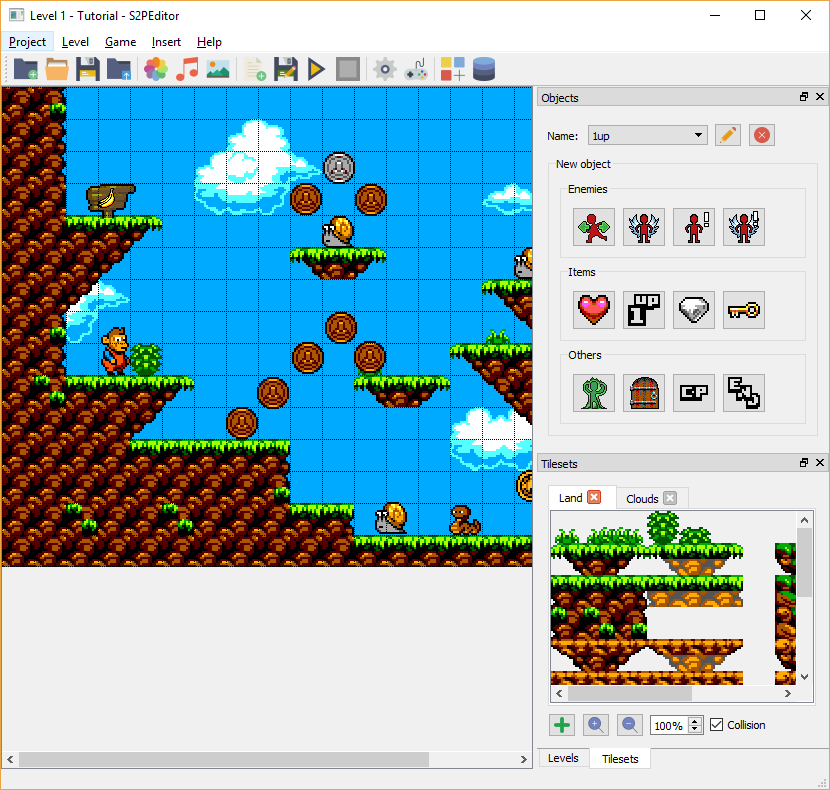
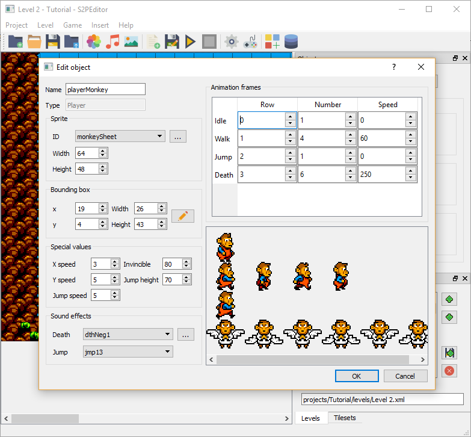
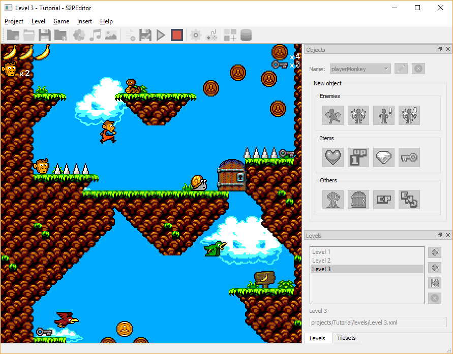

# S2PEditor
*This README is under construction. Deployment version has not been uploaded yet.*
## Description
Game engine and GUI for the development of 2D platform games in Windows. Built using C++, SDL and Qt. 
## Table of Contents
1. Installation
1. Usage
1. Credits
1. License
## Installation
There is no need for installation, just run S2PEditor.exe under Deployment directory.
## Usage
After running the executable, you will access S2PEditor GUI. You can see some screenshots below. For deeper info about usage, go to the wiki.

## Credits
S2PEditor and s2Dp have been designed and programmed by Aarón Ojeda. 

S2PEditor is a GUI for s2Dp framework, which is a modified and extended version of the framework proposed by Shaun Mitchell in his book SDL Game Development (2013).

All art assets used in the project are copyrigth free. They are listed below along with the authors.
### Sprites
* *Monkey Lad in Magical Planet*, by Carl Olsson (a.k.a: surt).
* *Monsterboy in Wonder World*, by Carl Olsson.
* *420 pixel art icons for RPG*, by Henrique Lazarini (a.k.a: Ails).
* *arachnestuff*, by Arachne.
* *Items and elements*, by Jason GrafxKid.
* *Interaction Assets*, by Madebyoliver de FlatIcon.
* *Essential Colection*, by Madebyoliver de FlatIcon.
* *Technology Elements*, by Madebyoliver de FlatIcon.
### Sounds
* *The Essential Retro Video Game Sound Effects Collection*, by Juhani Junkala.
* *Random silly chip song*, by Bart Kelsey.
* *House in a Forest Loop*, by HorrorPen.
* *A Journey Awaits*, by Pierre Bondoerffer (@pbondoer).
### TrueType fonts
* *Boxy-Bold*, by Clint Bellanger. Website: http://clintbellanger.net.
* *Karma Suture*, by Typodermic Fotns.
## License

